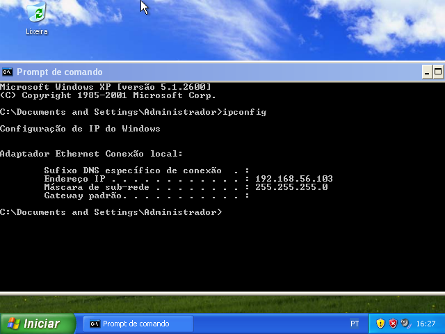
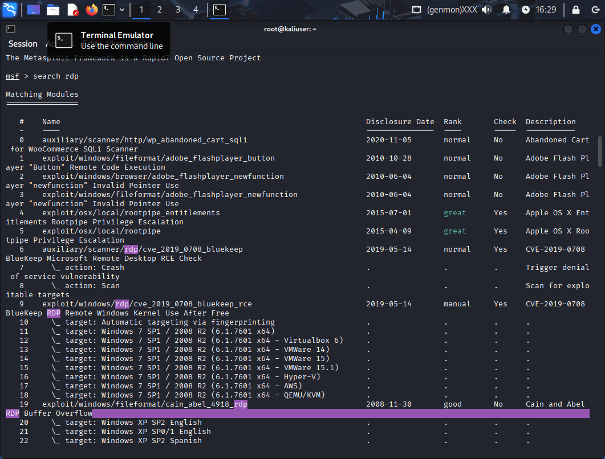
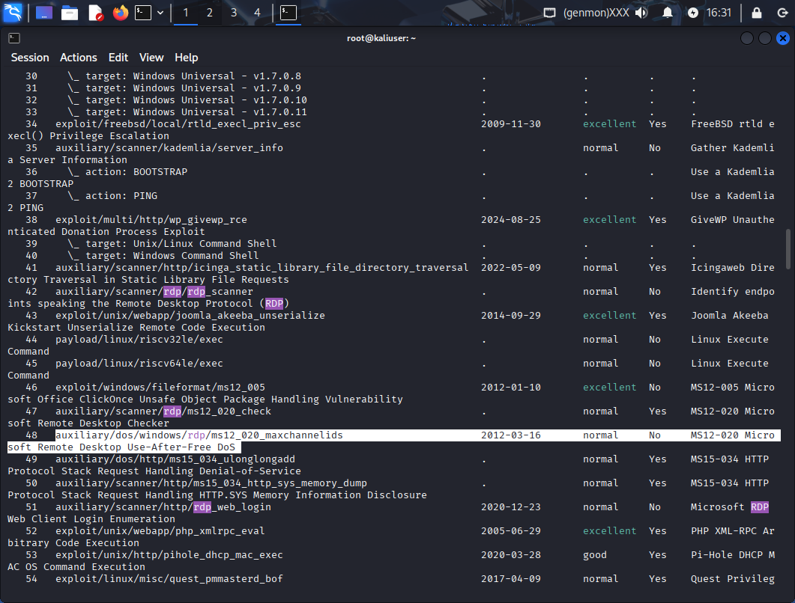
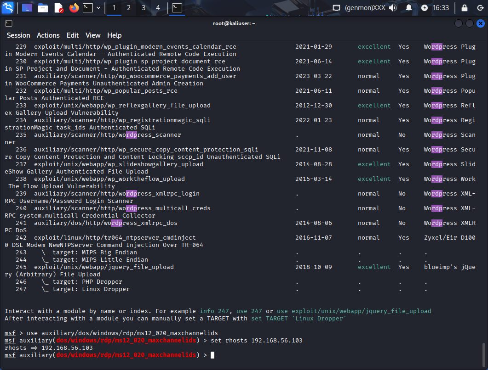
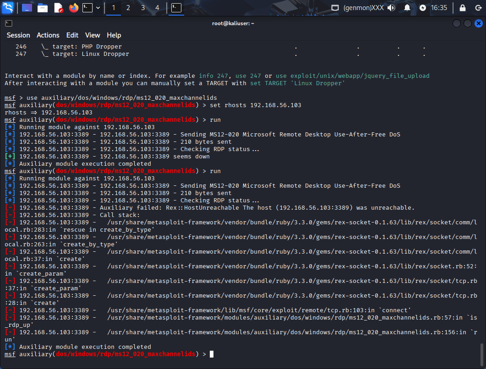

# ataque-DOS-Windows-RDP
Ataque DOS no Remote Desktop Protocol do Windows

 

IP do alvo 

 

Procurando Exploit DOS para o RDP

 

Exploit encontrado

 

colocando IP do alvo no Exploit

 

rodando o Exploit

 

Windows sofrendo o ataque DOS
